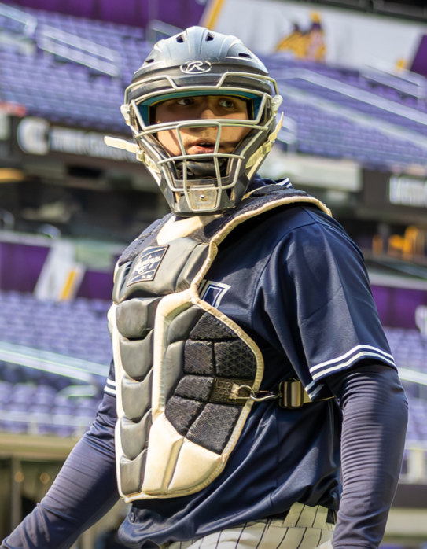
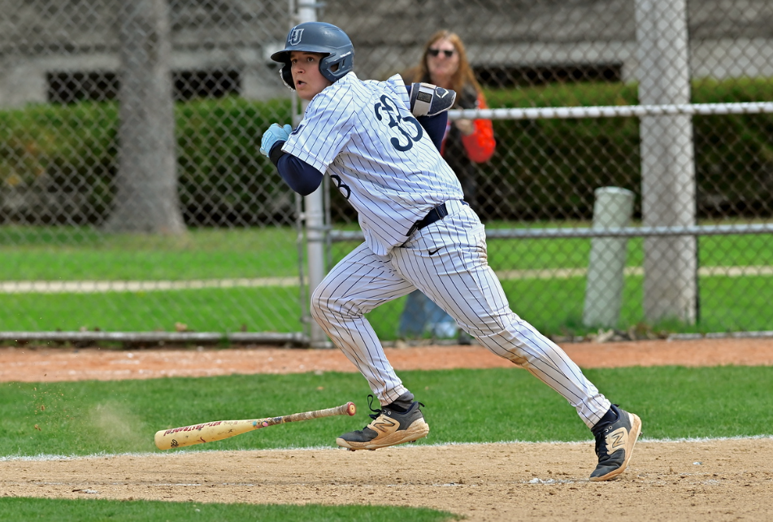
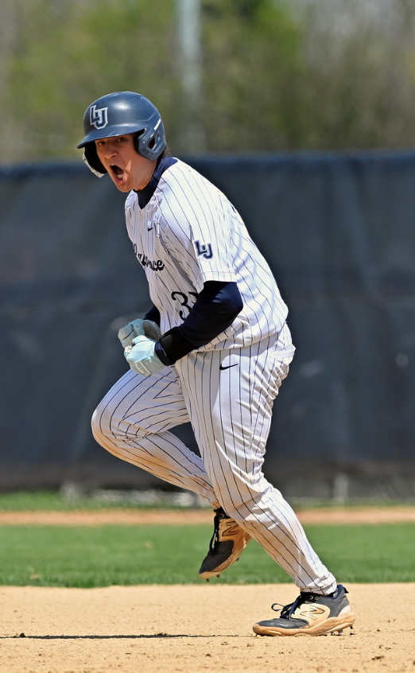

## Economics and Data Science

I will be graduating with a Major in Economics and a Minor in Data Science. I wanted to pursue economics because it gives you the foundation for how markets work and what drives them. I wanted to minor in data science because it teaches you how to work with data, whether its understanding it, manipulating it, or trying to visualize it. These are good skills to have no matter which field I end up in. 

## Baseball Career

I have been playing baseball since the age of 7. It's been a huge part of my life up until recently when i retired from the sport. I played travel ball throughout my childhood. I played 3 years of Varsity Baseball in High school and 4 years of collegiate ball at Lawrence University. 

My position of choice has always been catcher because it requires both a sharp mind and athleticism. The catcher is the field general who takes control of the game and strategizes with his pitcher to give his team an edge. 


<table>
<tr>
<td width="50%">

{height=300px}

</td>
<td width="50%">

{height=300px}
</td>
<td width="50%">

{height=300px}

</td>
</tr>
</table>

## Hobbies

```{r}
#| echo: false
library(emoji)
```

Now that I am a retired collegiate athlete, I have a lot more time on my hands. I have picked up golf as a hobby to help stay in shape, but also to feed my competitive drive. I have a lot of fun competing with my brother, dad, and grandfather who all regularly trounce me `r emoji("grinning face with sweat")`.

I also do investing as a hobby where I spend a lot of time researching different stocks and picking the ones I like best. This was something I first started doing with my grandfather, and overtime he taught me how the market works and what to look for. 
